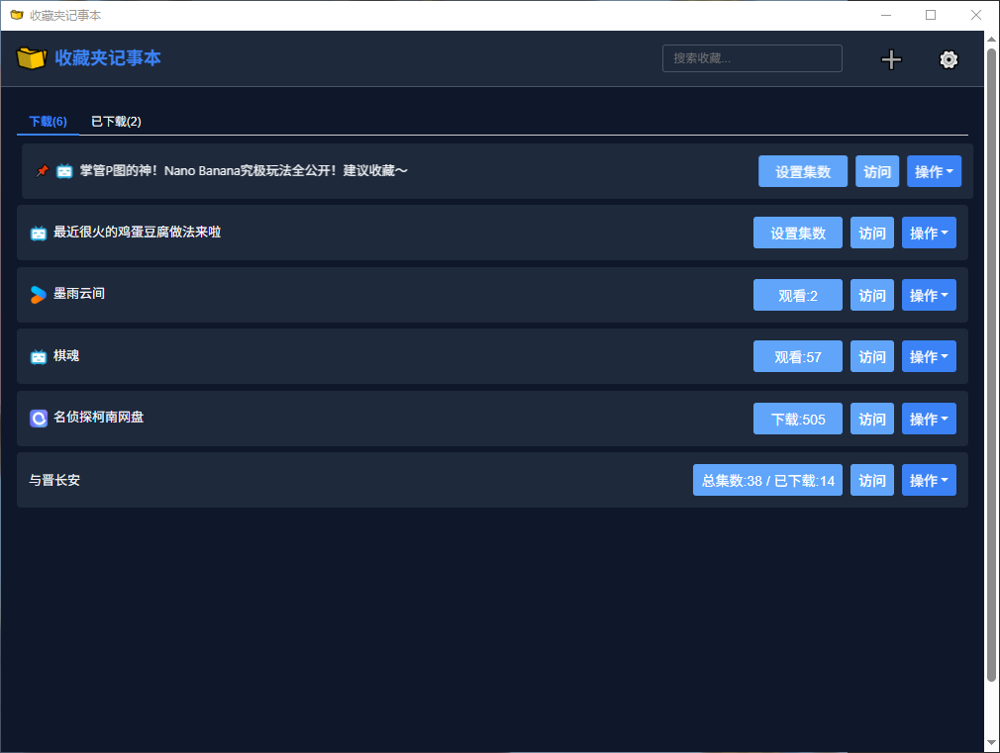
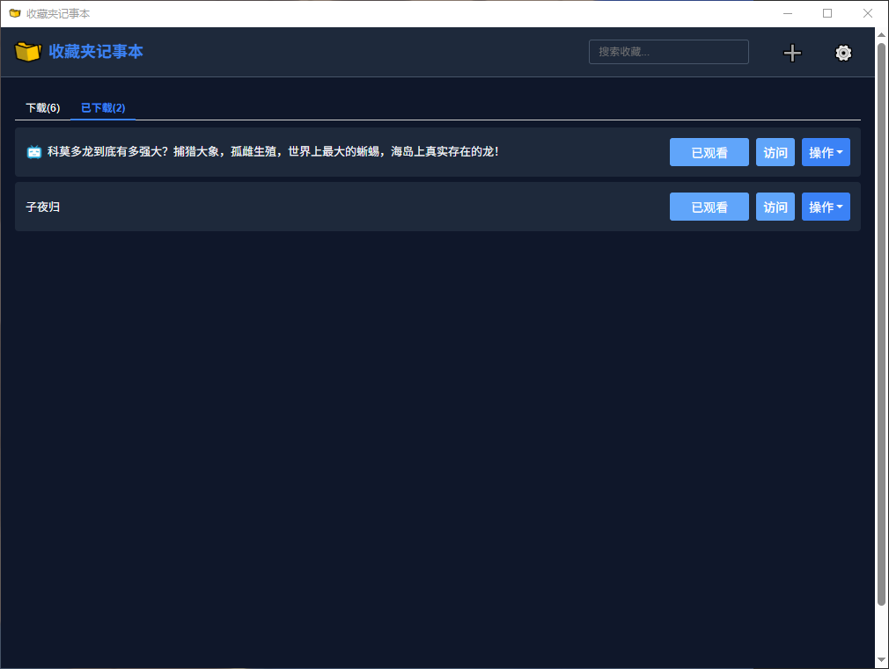
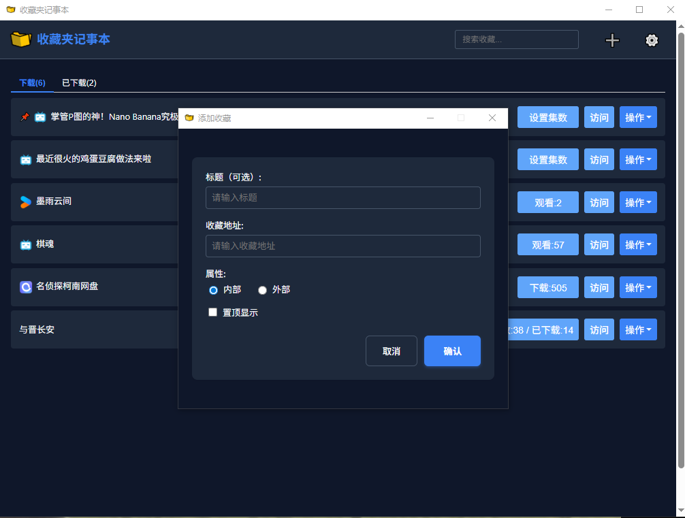
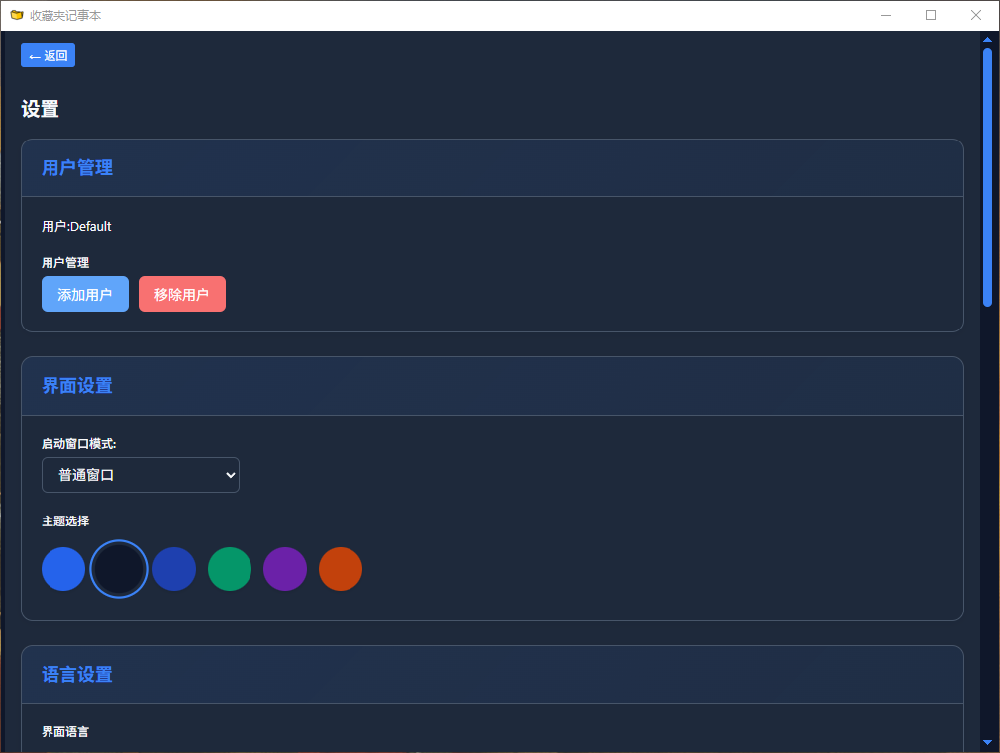
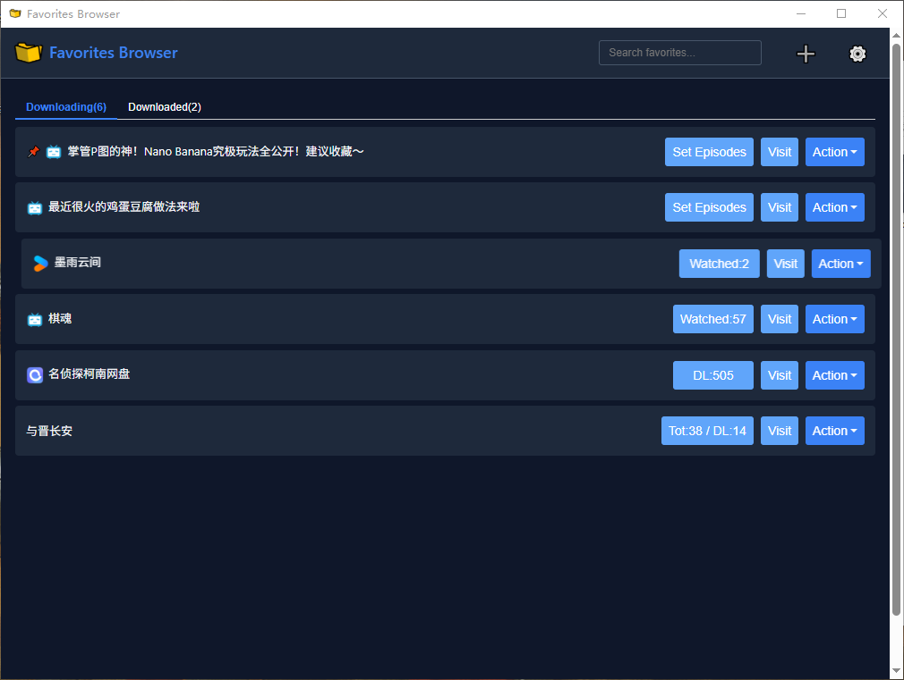

# 收藏夹记事本 (Favorites Browser)

收藏夹记事本（Favorites Browser）是一款基于 Electron 构建的高效收藏夹管理应用，旨在帮助用户轻松组织、管理和访问各类收藏内容。无论是网页链接、重要文档、媒体资源还是个人笔记，都能通过本应用进行统一管理和快速检索。

## 当前版本

**1.0.4**

## 功能特点

- **简洁美观的用户界面**：采用现代化设计，提供直观易用的操作体验
- **分类管理收藏内容**：支持多用户模式，每个用户拥有独立的收藏空间
- **快速搜索和访问收藏**：提供高效的搜索功能，让您快速找到所需内容
- **自定义标签和分类**：灵活的标签系统，方便对收藏内容进行精细化管理
- **集数管理功能**：特别支持对剧集、系列内容的集数和下载状态进行跟踪
- **数据导入导出功能**：支持 JSON 格式数据的导入导出，确保数据安全和迁移便捷
- **跨平台支持**：全面支持 Windows、macOS 和 Linux 系统

## 应用截图

以下是收藏夹记事本的主要界面截图：

### 主界面截图


### 分类管理界面


### 内容详情界面


### 搜索功能界面


### 设置界面


### 导入导出功能


## 安装方法

### 从应用商店下载

#### Windows
- 前往 [微软商店](https://www.microsoft.com/store/apps/FavoritesBrowser) 搜索"收藏夹记事本"或"Favorites Browser"
- 点击"获取"按钮完成安装

#### macOS
- 可通过 DMG 安装包或 App Store（如有上架）安装

#### Linux
- 提供 AppImage、Deb 和 Snap 等多种安装格式，适应不同 Linux 发行版

### 从源码构建（开发者指南）

#### 1. 前提条件
- 安装 [Node.js](https://nodejs.org/) 16.x 或更高版本
- 安装 [npm](https://www.npmjs.com/) 或 [yarn](https://yarnpkg.com/)

#### 2. 获取源码
```bash
git clone https://github.com/yourusername/favorites-browser.git
cd favorites-browser
```

#### 3. 安装依赖
```bash
npm install
```

#### 4. 开发模式运行
```bash
npm start
```

#### 5. 构建应用
- 构建应用程序包
```bash
npm run build
```
- 仅打包不构建安装程序
```bash
npm run pack
```
- 构建特定平台版本
```bash
# Windows 版本
electron-builder --win

# macOS 版本
electron-builder --mac

# Linux 版本
electron-builder --linux
```

构建后的应用程序将输出到 `dist` 目录。

## 使用说明

### 基本操作

1. **添加收藏**：点击界面上的"添加"按钮，填写标题、URL、标签等信息并保存
2. **编辑收藏**：选中要编辑的收藏项，点击"编辑"按钮进行修改
3. **删除收藏**：选中要删除的收藏项，点击"删除"按钮
4. **搜索收藏**：在搜索框中输入关键词进行搜索
5. **用户管理**：支持添加和切换不同用户，每个用户拥有独立的收藏空间

### 高级功能

1. **集数管理**：对于剧集类收藏，可以设置总集数和已下载集数
2. **导入导出**：支持 JSON 格式的数据导入导出，便于数据备份和迁移
3. **使用外部浏览器打开**：可以选择使用系统默认浏览器打开收藏的链接

## 构建说明

收藏夹记事本支持多平台构建，配置信息已在 `package.json` 文件中定义。

### 构建输出

构建后的应用程序将输出到 `dist` 目录，根据不同平台生成相应的安装包：

- **Windows**：生成 APPX（适用于微软商店）、NSIS 安装程序和便携版
- **macOS**：生成 DMG 安装包和 ZIP 归档
- **Linux**：生成 AppImage、Deb 包和 Snap 包

### 平台特定配置

- **Windows**：支持自定义安装路径、创建桌面快捷方式和开始菜单快捷方式
- **macOS**：启用强化运行时、配置 Gatekeeper 设置和应用权限
- **Linux**：设置应用分类、图标和桌面条目信息

## 开发指南

### 技术栈
- **主框架**：Electron 37.5.0
- **前端技术**：HTML5、CSS3、JavaScript
- **构建工具**：electron-builder 26.0.12
- **运行环境**：Node.js 16.x 或更高版本
- **图标库**：Font Awesome 7.0.1

### 项目结构
```
Favorites browser/
├── .gitattributes                 # Git 属性配置
├── .gitignore                     # Git 忽略文件配置
├── .vercel/                       # Vercel 配置文件
├── .vscode/                       # VS Code 编辑器配置
├── README.md                      # 项目说明文档
├── about.html                     # 关于页面
├── add-dialog.html                # 添加收藏对话框
├── assets/                        # 资源文件目录
│   ├── alipay-qrcode.png          # 支付宝捐赠二维码
│   └── images/                    # 图片资源目录
├── build/                         # 构建资源目录
│   ├── entitlements.mac.plist     # macOS 应用权限配置
│   ├── icons/                     # 应用图标资源
│   └── installer.nsh              # NSIS 安装脚本配置
├── colors.css                     # 颜色主题和变量定义
├── custom-window.html             # 自定义窗口模板
├── edit-dialog.html               # 编辑收藏对话框
├── episode-dialog.html            # 集数管理对话框
├── favorite.html                  # 收藏详情页面
├── index.html                     # 应用主窗口
├── language.js                    # 语言翻译文件
├── main.js                        # Electron主进程代码
├── package.json                   # 项目依赖和构建脚本
├── privacy-policy.md              # 隐私政策文档
├── styles.css                     # 全局样式表
├── test-parser.js                 # 解析逻辑测试工具
├── update-version.bat             # 版本更新批处理脚本（Windows）
├── update-version.js              # 版本更新主脚本
└── username-dialog.html           # 用户名设置对话框
```

> 注：一些特定平台的构建指南文档（如harmonyos-build-guide.md、linux-build-guide.md、macos-build-guide.md等）和其他指南文档已配置为本地文档，不会上传到GitHub仓库，但会保留在本地供开发者参考。

### 版本更新工具说明
项目包含了用于便捷更新应用版本信息的工具：

- **update-version.bat**：Windows平台下的批处理文件，用于启动版本更新脚本
- **update-version.js**：核心版本更新脚本，提供交互式界面用于更新应用版本号

使用方法：
1. 双击运行 `update-version.bat`
2. 根据提示输入新版本号（格式：X.Y.Z）
3. 确认更新后，脚本会自动更新相关文件中的版本信息

这些工具简化了版本管理流程，确保版本信息在整个项目中的一致性。

## 开发规范

### 代码风格
- 遵循 JavaScript 标准规范
- 使用一致的缩进和命名约定
- 为关键函数和复杂逻辑添加注释

### 提交规范
- 使用清晰简洁的提交信息
- 一个提交对应一个功能或修复
- 提交前确保代码通过测试

## 贡献指南

我们欢迎社区成员对项目进行贡献，无论是修复 Bug、添加新功能还是改进文档，都能帮助项目变得更好。

### 贡献流程
1. Fork 本仓库到您的个人账户
2. 创建一个新的特性分支 (`git checkout -b feature/your-feature-name`)
3. 在您的分支上进行开发和测试
4. 确保您的代码符合项目的代码风格
5. 提交您的更改 (`git commit -m 'Add some feature'`)
6. 将您的分支推送到 GitHub (`git push origin feature/your-feature-name`)
7. 创建一个 Pull Request，描述您的更改和实现

## 许可协议

本项目采用 [MIT 许可证](LICENSE)。根据许可证，您可以自由使用、修改和分发本软件，但需保留原始版权和许可声明。

## 支持与捐赠

收藏夹记事本是一款完全免费的开源软件，我们致力于为用户提供最好的收藏管理体验。

如果您觉得这款软件对您有所帮助，并且经济条件允许，欢迎通过以下方式支持开发者，您的每一份支持都是我们继续开发和改进的动力！

### 支付宝捐赠

扫描下方二维码，您可以请开发者喝杯咖啡，表达您的支持和鼓励。


## 联系方式

如有任何问题、建议或合作意向，欢迎通过以下方式与我们交流：
- GitHub：通过 GitHub Issues 或 Pull Requests 与我们交流

---

收藏夹记事本 (Favorites Browser) —— 让收藏管理变得简单
